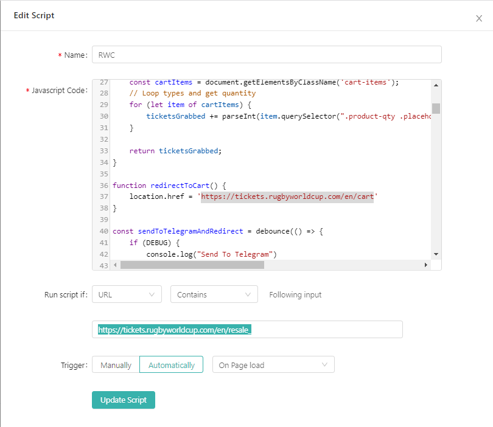

## Rugby World Cup 2023 Ticket Bot

This is a small Javascript script that will grab tickets from the ticket portal and add them to the basket, then redirect when certain conditions are met.

:exclamation: <b>Disclaimer</b>
```
    This "bot" was written for educational purposes. It won't guarantee anything but may improve your chances of
    obtaining a ticket. Any misuse of the tool, and consequences of such actions are your own responsibility.

    Use at your own risk!
```

### Features
    * Set Desired amount of tickets
    * Set Max Price per ticket
    * Get Notified by Telegram bot (extra setup), with cart ticket details.
    * Auto Reloads on Throttle, no tickets. Set and forget!
    * Prioritises Multi-Packs

### Setup

This has been tested and developed using Google Chrome, so I highly recomment that browser for the best results.


- Install Extension - [Scripty](https://chrome.google.com/webstore/detail/scripty-javascript-inject/milkbiaeapddfnpenedfgbfdacpbcbam)


#### Ticket Portal

1. Create New Script

2. Paste the contents of []{} into the "Javascript Code" box

3. Changed options to the following:

<details>
    <summary>Expand for image</summary>
    <p align="center">
        
    <p>
</details>

4. Click "Update"

5. Enable the script with the slider option

6. Navigate to the ticket portal you wish to run this script on

eg.

```
    https://tickets.rugbyworldcup.com/en/resale_{Match}
```

#### Cart

1. Create New Script

2. Paste the contents of []{} into the "Javascript Code" box

3. Changed options to the following:

<details>
    <summary>Expand for image</summary>
    <p align="center">
        
    <p>
</details>

4. Click "Update"

5. Enable the script with the slider option

#### Telegram Bot

Replace the `token` and `chat_id` with your own:

```JS
    const token = "<telegram-bot-token>";
    // Get chat_id from https://api.telegram.org/bot<api-key>/getUpdates
    const chat_id = "<telegram-chat-id>";
    const url = `https://api.telegram.org/b
```

Get the bot token by following the guide [HERE](https://core.telegram.org/bots/tutorial#obtain-your-bot-token)